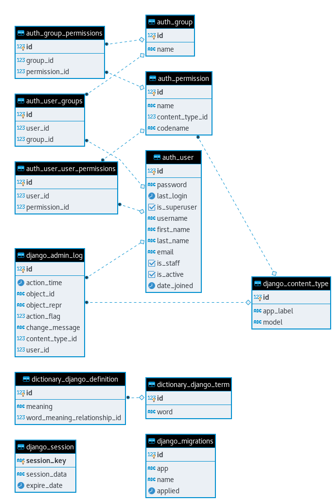
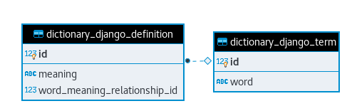

# DictionaryDjango
[](https://opensource.org/licenses/Apache-2.0)


Dictionary web application implemented with web framework Django.

## Deployment
If you need deployment the application, you need to do all this steps. The last step (5) only use if you want to delete all configuration in your machine, after doing steps 1-4.
1. ```docker-compose up -d --build```
2. ```docker-compose exec dictionary_django python manage.py makemigrations dictionary_django```
3. ```docker-compose exec dictionary_django python manage.py migrate```
4. ```docker-compose exec dictionary_django python manage.py createsuperuser```
5. ```docker-compose down```

## Testing
Use next command to do the application tests.

```docker-compose exec dictionary_django python manage.py test```

## Database diagram
I have use two entities: term and definition. The entity terms do references to word in dictionary and definition do references to meaning of this word. In my design i decided to use a foreign key between this entities because one word have more than one meaning but a word only appear in dictionary only once.

##### All database diagram
The next diagram corresponds to all database diagram.



##### Only added models database diagram
The next diagram corresponds specifically the database diagram of added models.


